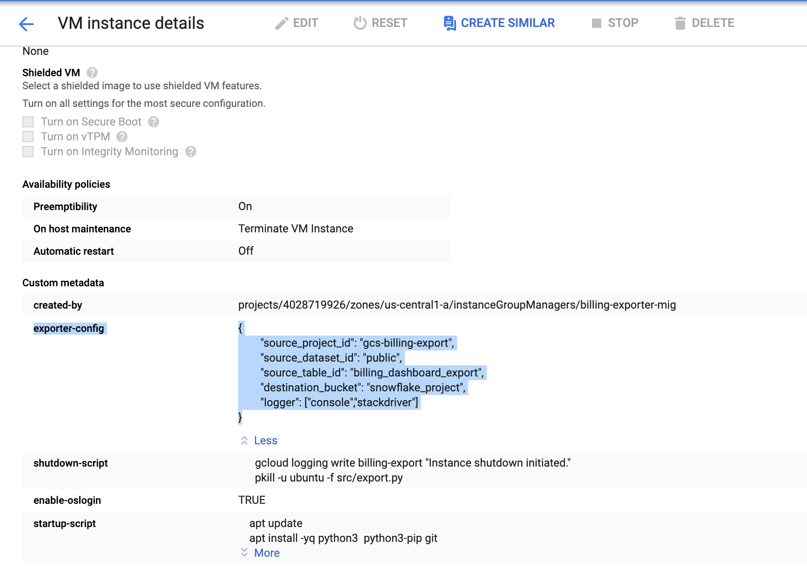

# Billing Export to GCS Bucket

## Purpose

This tool is built to export the billing table from Big Query to Google Cloud Storage in an automated, recurring basis, at a set schedule. This addresses a feature gap in BigQuery  Billing Extract vs the GCS billing extract, since the GCS billing export doesn't support labels at the time of building this solution.

The goal of this solution is to store json Billing export date partitions in a specified google bucket. The solution is customized to store export json extracts specific to the billing tables with auto healing feature to re-run the process for the failed partitions from the previous executions.

## Design

The exporter tool is a python script that runs on premptible vm that manages the export run schedule and hosts the exporter script as well.

The schedule is controlled by cron on the VM and can be customized during the deployment. The tool can be run <I>ad hoc</I> as well, by logging manually into the VM instance and triggering the tool from the command line with appropriate options. The tool is fault tolerant, idempotent and checkpoints the work done for recovery from preemptions.

## Set Up

This tool can be deployed using Terraform, an infrastructure automation tool that provisions Google Cloud resources automatically. The deployment script is in another repository that should be the starting point for the installation of this tool: https://source.cloud.google.com/cloud-professional-services/snowflake-billingexport-foundations 

#### **Pre-requisites**

* A project to host the billing export repos and the cloud resources 
* GCloud command line tool installed and authenticated.
* A Cloud Storage bucket created to store the billing data. 
* Enable the following APIs:
    * BigQuery API
    * Cloud Storage API
    * Compute Engine API
    * Cloud Source Repository API
    * Stackdriver API
* A Big Query data set created to stage the billing data.
* Billing Export to BigQuery enabled [(instructions)](https://cloud.google.com/billing/docs/how-to/export-data-bigquery#how_to_enable_billing_export_to) and flowing into the above data set.
* Two Cloud Source Repositories to store the query job code and the deployment script.
    * _billing-export_, for the exporter script.
    * _billing-export-deploy_, for the deployment script.
    * **Note**: The names above are only indicative and can be anything.
* A Service account to run the export job and grant the following roles:
    * BigQuery User
    * BigQuery DataViewer, preferably at the project level.
    * roles/compute.instanceAdmin
    * Compute OS Admin Login
    * Logs Writer
    * Source Repository Reader
* In addition, the service account will need Storage Admin access  on the Billing storage bucket.


## Getting Started

The exporter script assumes the code is deployed on a premptible VM set with pre-configured **"exporter.config"** instance metadata as shown.



With the cron trigger, the tool will run the exporter script with pre-configured exporter-config values. Below is the explantion of the pre-configured values.

````
    "source_project_id": source project id 
    "source_dataset_id": source dataset id
    "source_table_id":   source table id
    "destination_bucket": destination bucket
    "logger": List of log handlers. Available handlers - "console","stackdriver"
```` 

The cron trigger will run the below command.
````
    python3 /opt/billing-export/src/export.py
````

The initial run of the script will extract the historical data as date partition extract json files. 

Below the structure of the data storage.
    
````
    --Bucket_name
            |-- Table_name1
            |        |-- process_status/
            |        |       |--  extract_status_file.json
            |        |       |--  exporter.log
            |        |
            |        |-- partition date1(format: yyyymmdd)
            |        |        |-- billing-export-*.json
            |        |--  partition date2(format: yyyymmdd)
            |        |        |-- billing-export-*.json
            |        |--  partition date3(format: yyyymmdd)
            |        |        |-- billing-export-*.json
            |        |--  ....
            |
            |-- Table_name2
            |        |-- process_status/
            |        |       |--  extract_status_file.json
            |        |       |--  exporter.log
            |        |
            |        |-- partition date1(format: yyyymmdd)
            |        |        |-- billing-export-*.json
            |        |--  partition date2(format: yyyymmdd)
            |        |        |-- billing-export.json
            |        |--  partition date3(format: yyyymmdd)
            |        |        |-- billing-export-*.json
            |        |--  ....
````
            

Below are the features of the script-

1. **Historical run** -  The script will run for historical data when run for the first time and will create the status file, log file and date partition folders with the json extracts.

2. **Delta run** - With every next run, the script will only consider the delta date export partitions to extract the data, followed by auto healing run which is explained in detail below.

3. **Status tracking of successful partition extracts** - The script will create a status file (***gs://<bucket-name>/<table_id>/process_status/extract_status_file.json***) which will store the details of export partitions.
    
    Status file is also stored locally under ***/billing-export/<table_id>/process/extract_status_file.json***
    
    
````
   
    
4. **Auto Healing feature** - The script auto heals itself with every run.
````
    a. It will re-run for the failed/unsuccessful partitions for the records which do not have <b>"status": "success"</b> flag in the status file.
    b. It will check the gcs date extract locations for all the previous exported partitions and re-run to extract the export json files for missing files.
````

5. **Customized extract storage for multiple billing export tables** - 
    The script will support storing billing export json extracts under  <b> gs://<bucket-name>/<table_id>/ </b>. It will not override the json extracts for multiple billing tables.
    
    Note: This is applicable for only different table names for different dataset and project-id. If the script is run on 2 tables with same name under different dataset or project-id, the data is overridden in the extracts.  
    
6. **Termination signal handling** - The script will handle <b> SIGNUM, SIGTERM </b> termination signals. It will gracefully exit during any interrupting event. It will save the logs, extract_status_file before exiting.

7. **Logging** 
````
    a. Logging is provided specific to the export table. 
    b. File logging handler saves the logs in file and save the file locally <b>/billing-export/<table_id>/process/logging.log</b> and in the gcs location <b>gs://<bucket-name>/<table_id>/process_status/exporter.log</b> 
        This is the default logging handler.
    c. Script is customized to configure other logging handlers <b> "console","stackdriver"</b> through exporter-config instance metadata or through config file which is provided during manual run.
        If <b>"logger": ["console","stackdriver"]</b> is not provided in the exporter-config, these handlers are set by default and all the 3 handlers (<b>"console","stackdriver", file handler</b>) are available.
````   
 
        ex."logger": ["stackdriver"] will set only stackdriver and File handlers.
    
        Stackdriver logging can be found as below. Logs are structured as
        <filename>:<line number> <log level>  <table_id> - <message>

````      
        resource.type="global"
        logName="projects/gcs-billing-export/logs/billing-export"
    
         
        
```` 

8. **Manual run** - Exporter script can be run manually. 

    Login to the compute server as shown below..

    

        $ sudo su - ubuntu
    
        $ cd /opt/billing-export

        $ python3 src/export.py --config_file <config_file path>

        usage: export.py [-h] [--config_file [CONFIG_FILE]]
                 [--export_start_date [EXPORT_START_DATE]]
                 [--export_end_date [EXPORT_END_DATE]]
                 [--historical_run [HISTORICAL_RUN]]

    Arguments - 

    --config_file is mandatory parameter for manual run. 
    Required values are -
````
            "source_project_id": source project id 
            "source_dataset_id": source dataset id
            "source_table_id":   source table id
            "destination_bucket": destination bucket 
````
        

````
    --export_start_date - (optional)Billing export partition date with format yyyymmdd
    --export_end_date - (optional)Billing export end date with format yyyymmdd
    --historical run - (optional)boolean value true/false to run for historical data
````

````  
    a. In an exceptional scenario, if user want to run for a particular period, user can run manual process providing the start_date and end_date parameters as per below command.
    
    $ python3 src/export.py --config_file conf/<config_file path> --export_start_date <yyyymmdd> --export_end_date <yyyymmdd>
    
    The exporter script will run for the provided dates and override json extracts for the date partitions.
    
    b. If end_date argument is not provided in the command, the script will assume date partitions extract from start_date to current date. 
    
    $ python3 src/export.py --config_file conf/<config_file path> --export_start_date <yyyymmdd>
    
    c. If start date and end date arguments are not provided, the script will run for the delta update. Export script will check the latest success run from the status file.
    (gs:// /<table_id>/process_status/extract_status_file.json) and run the delta extract. 
    
    $ python3 src/export.py --config_file conf/<config_file path>
    
    d.Historical run - Historical run will extract all the date partitions and override the extract if exists.
    $ python3 src/export.py --config_file conf/<config_file path> --historical_run true
````
   
## Running the tests
````
    cd test/
    pytest -v test_export.py --config_file conf/exporter_config.json --export_start_date <date> --export_end_date <date> -s 
````
    
Following pytests are provided.
1. Test argument parser
2. Test config file for mandatory parameters
3. Verify gcs_bucket exists
4. Verify if extract status file exists
5. Test create blob in gcs bucket
6. Test create local extract status file
7. Read latest extract export date from status file
8. Test bigquery query to get partitions
9. Test big_query_client.dataset
10. Assert write to local status file
11. Test upload file to gcs bucket

-----------------

DISCLAIMER <p>
Copyright 2019 Google LLC. This software is provided as-is, without warranty or representation 
for any use or purpose. Your use of it is subject to your agreement with Google. 
